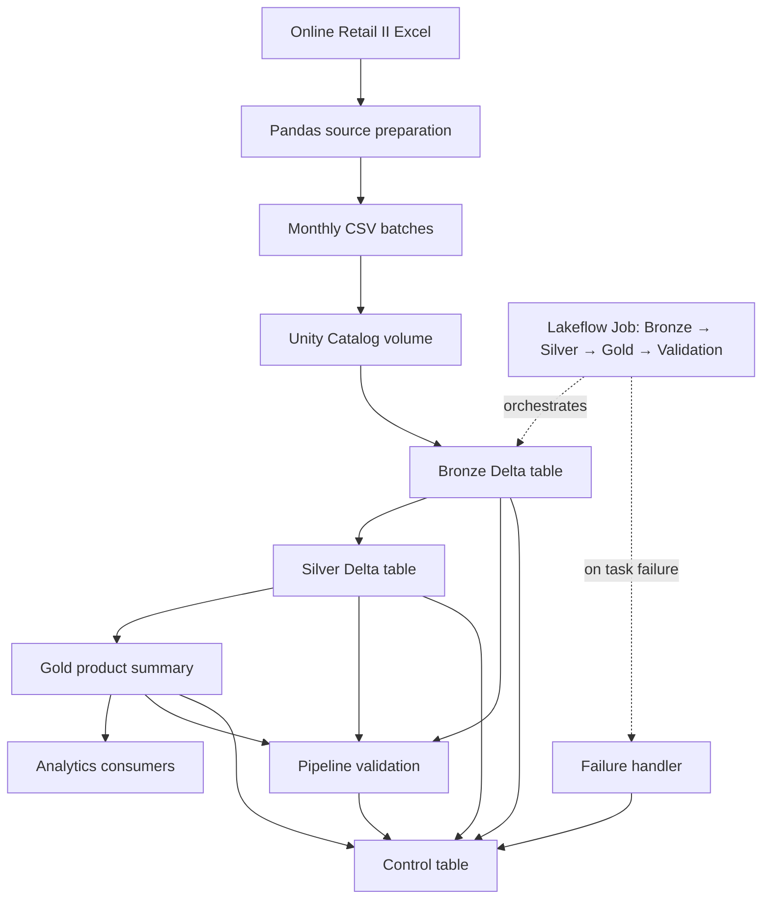
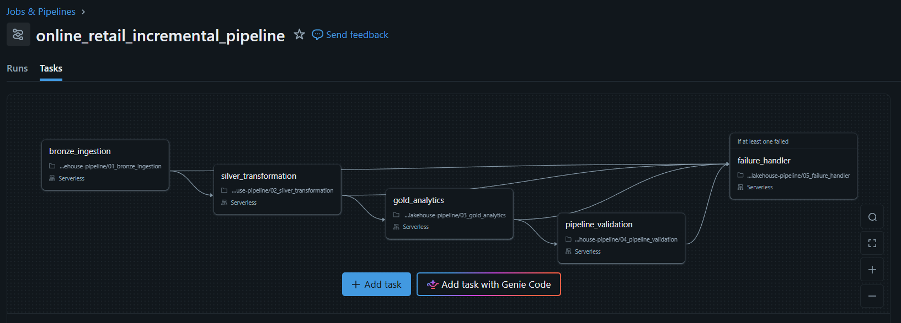
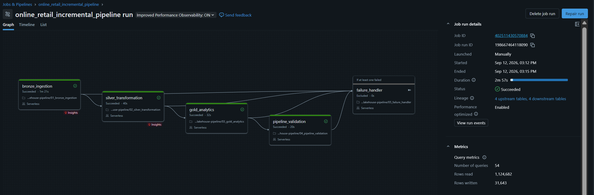
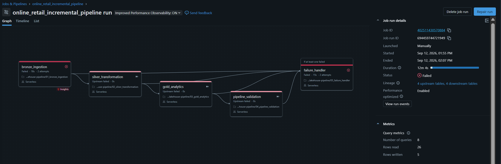
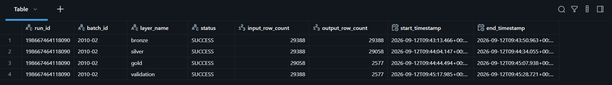
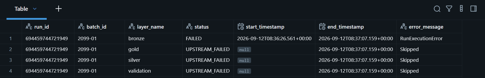

# Online Retail Lakehouse Pipeline

An incremental batch data engineering pipeline built with Databricks, PySpark, Delta Lake, Unity Catalog, Lakeflow Jobs, and Pandas. The project processes monthly retail transactions through Bronze, Silver, and Gold layers with idempotent Delta `MERGE` operations, cross-layer reconciliation, run auditing, failure handling, and operational monitoring.

## Project overview

The source is the [Online Retail II dataset on Kaggle](https://www.kaggle.com/datasets/mashlyn/online-retail-ii-uci), supplied as an Excel workbook with two worksheets and **1,067,371 transaction records**.

The pipeline has two stages:

1. **Local source preparation:** Pandas preserves workbook lineage, combines the worksheets, derives monthly batch IDs, exports 25 monthly CSV files, and reconciles the exported row count with the source workbook.
2. **Databricks lakehouse processing:** A parameterized Lakeflow Job processes a selected monthly batch through Bronze, Silver, Gold, and validation tasks. A separate failure-handler task records unsuccessful task states.

Three monthly batches were processed to demonstrate the completed pipeline:

| Batch | Purpose |
|---|---|
| `2009-12` | Initial table creation and baseline processing |
| `2010-01` | Incremental load and Delta `MERGE` testing |
| `2010-02` | Orchestrated processing and end-to-end idempotency testing |

## Architecture





## Technology stack

| Technology | Usage |
|---|---|
| Python and Pandas | Read the Excel workbook, preserve source lineage, generate monthly batches, and reconcile exported rows |
| Databricks | Lakehouse development and execution environment |
| PySpark | Distributed ingestion, transformation, aggregation, profiling, and reconciliation |
| Delta Lake | Managed tables, ACID transactions, and idempotent `MERGE` operations |
| Unity Catalog | Catalog, schema, table, and volume organization |
| Lakeflow Jobs | Parameterized orchestration, task dependencies, and failure routing |
| Databricks SQL | Environment setup and operational monitoring queries |
| GitHub | Project repository, documentation, and execution evidence |

## Data flow and implementation

### Source preparation

The Pandas preparation notebook:

- Reads both workbook worksheets.
- Adds `source_sheet` and the original Excel `source_row_number` before combining the data.
- Derives `batch_id` from `InvoiceDate` in `YYYY-MM` format.
- Exports **25 monthly CSV batches**.
- Reconciles the exported files with all **1,067,371 source rows**.

The source workbook and generated CSV files are excluded from this repository.

### Bronze layer

**Parameterized source**

```text
/Volumes/online_retail/bronze/source_files/online_retail_{batch_id}.csv
```

**Target**

```text
online_retail.bronze.transactions_raw
```

The Bronze process:

- Validates the `batch_id` parameter in exact `YYYY-MM` format.
- Reads one monthly CSV using an explicit PySpark schema.
- Renames source columns to consistent `snake_case` names.
- Preserves workbook lineage and adds Databricks file metadata.
- Adds an ingestion timestamp.
- Generates a stable SHA-256 `record_id` from `source_sheet` and `source_row_number`.
- Validates row counts, key uniqueness, null keys, and batch assignment.
- Uses an insert-only Delta `MERGE` so reruns do not duplicate records or overwrite the initially ingested Bronze version.

### Silver layer

**Source**

```text
online_retail.bronze.transactions_raw
```

**Target**

```text
online_retail.silver.transactions_clean
```

The Silver process:

- Profiles missing values, negative quantities, zero prices, and cancelled invoices.
- Removes duplicate business records using a deterministic `row_number()` window.
- Trims relevant text fields.
- Removes the trailing `.0` introduced in populated customer identifiers.
- Retains missing customer IDs, missing descriptions, and negative quantities for downstream analysis rather than deleting potentially genuine records.
- Adds `is_cancelled`, `has_customer_id`, `has_description`, and `is_positive_sale` flags.
- Calculates `line_total` as `quantity * price`.
- Upserts records with Delta `MERGE` using `record_id`.
- Validates stored counts, duplicate keys, missing prepared records, and obsolete records.

A positive sale is a non-cancelled record whose quantity and price are both greater than zero.

### Gold layer

**Source**

```text
online_retail.silver.transactions_clean
```

**Target**

```text
online_retail.gold.product_sales_summary
```

The Gold table has a monthly product grain of `batch_id + stock_code`. It contains:

- Representative product description
- Total quantity sold
- Total revenue
- Distinct invoice count
- Distinct customer count

The Gold process filters to positive sales, validates the composite `MERGE` key, reconciles Silver and Gold measures, and synchronizes only the selected batch. Batch-scoped deletion removes obsolete product summaries without affecting other months.

## Processed batch results

| Batch | Bronze rows | Duplicates removed | Silver rows | Gold rows |
|---|---:|---:|---:|---:|
| `2009-12` | 45,228 | 506 | 44,722 | 3,057 |
| `2010-01` | 31,555 | 321 | 31,234 | 2,687 |
| `2010-02` | 29,388 | 330 | 29,058 | 2,577 |
| **Total** | **106,171** | **1,157** | **105,014** | **8,321** |

## Validation and reconciliation

The independent validation notebook checks that:

- Every requested batch exists in Bronze, Silver, and Gold.
- The Bronze count minus duplicate business records equals the Silver count.
- Silver contains no record IDs without a Bronze source record.
- Positive-sale quantity and revenue totals match between Silver and Gold.

Final `2010-02` reconciliation:

| Measure | Silver | Gold | Result |
|---|---:|---:|---|
| Total quantity | 381,879 | 381,879 | Passed |
| Total revenue | 551,504.72 | 551,504.72 | Passed |

The dataset does not provide a confirmed currency in this implementation, so revenue is shown without a currency symbol.

## Incremental processing and idempotency

Every Databricks processing notebook accepts `batch_id` and `run_id` parameters. Stable matching keys and Delta `MERGE` operations allow the same monthly batch to be rerun safely.

The `2010-02` batch was processed twice through the complete Lakeflow Job. The second run created a new audit history but left the stored counts unchanged:

| Layer | Stored rows after first run | Stored rows after rerun |
|---|---:|---:|
| Bronze | 29,388 | 29,388 |
| Silver | 29,058 | 29,058 |
| Gold | 2,577 | 2,577 |

## Orchestration and failure handling

The Lakeflow Job executes:

```text
bronze_ingestion
    -> silver_transformation
    -> gold_analytics
    -> pipeline_validation
```

The job-level `batch_id` and dynamic `run_id` parameters are pushed down to the notebook tasks. Downstream tasks run only after their dependencies succeed.

A separate `failure_handler` task depends on all four processing tasks and runs when at least one fails. It records failed and upstream-failed states in the control table, then deliberately raises an exception so the overall pipeline remains visibly failed.





## Auditing and monitoring

Each processing task writes operational metadata to:

```text
online_retail.control.pipeline_runs
```

The control table stores:

- Run ID and batch ID
- Layer name and execution status
- Start and end timestamps
- Input and output row counts
- Error classification

The standalone monitoring notebook displays recent executions, unsuccessful tasks, and per-run summaries. It is intentionally excluded from the automated job.





## Repository structure

```text
online-retail-lakehouse-pipeline/
├── docs/
│   └── images/
│       ├── lakeflow-job-dag.png
│       ├── successful-pipeline-run.png
│       ├── failure-handling-run.png
│       ├── successful-audit-records.png
│       └── failure-audit-records.png
├── notebooks/
│   ├── 01_prepare_monthly_batches.ipynb
│   └── databricks/
│       ├── 00_environment_setup.ipynb
│       ├── 01_bronze_ingestion.ipynb
│       ├── 02_silver_transformation.ipynb
│       ├── 03_gold_analytics.ipynb
│       ├── 04_pipeline_validation.ipynb
│       ├── 05_failure_handler.ipynb
│       └── 06_pipeline_monitoring.ipynb
├── .gitignore
└── README.md
```

| Notebook | Purpose |
|---|---|
| `01_prepare_monthly_batches.ipynb` | Prepare, export, and reconcile monthly CSV batches with Pandas |
| `00_environment_setup.ipynb` | Create and verify the Unity Catalog catalog, schemas, volume, and control table |
| `01_bronze_ingestion.ipynb` | Parameterized incremental ingestion into Bronze |
| `02_silver_transformation.ipynb` | Profile, deduplicate, clean, flag, validate, and upsert Silver records |
| `03_gold_analytics.ipynb` | Build and synchronize the monthly product-sales summary |
| `04_pipeline_validation.ipynb` | Perform Bronze-to-Silver and Silver-to-Gold reconciliation |
| `05_failure_handler.ipynb` | Record failed and upstream-failed task states |
| `06_pipeline_monitoring.ipynb` | Inspect audit history and summarize pipeline runs |

## How to run

1. Download the Online Retail II workbook from the dataset link above and place it at:

   ```text
   data/source/online_retail_II.xlsx
   ```

2. Run `notebooks/01_prepare_monthly_batches.ipynb` locally. It writes the monthly CSV files to `data/monthly_batches/`.
3. Import the Databricks notebooks and run `00_environment_setup.ipynb` once.
4. Upload the desired monthly CSV file to:

   ```text
   /Volumes/online_retail/bronze/source_files/
   ```

5. Create a Lakeflow Job with the dependency order shown above and add these job parameters:

   ```text
   batch_id = YYYY-MM
   run_id = {{job.run_id}}
   ```

6. Configure the Failure Handler to run when at least one upstream task fails.
7. Run the job for the selected monthly batch.
8. Use `06_pipeline_monitoring.ipynb` to inspect execution history and failures.

## Implementation summary

This project delivers a reusable incremental monthly lakehouse pipeline. Pandas prepared 25 monthly CSV batches, and three representative batches were processed through Databricks to validate initial loading, incremental Delta `MERGE`, orchestration, reconciliation, auditing, failure handling, and idempotent reruns.
