# Online Retail Lakehouse Pipeline

An incremental batch data engineering pipeline built with **Amazon S3, AWS IAM, Databricks, PySpark, Delta Lake, Unity Catalog, and Lakeflow Jobs**. The project prepares monthly retail transaction batches, lands them in S3, processes them through Bronze, Silver, and Gold Delta layers stored back in S3, and validates, audits, and handles failures at the workflow level.

## Project overview

The source is the [Online Retail II dataset on Kaggle](https://www.kaggle.com/datasets/mashlyn/online-retail-ii-uci), supplied as an Excel workbook with two worksheets and **1,067,371 transaction records**.

The project has two stages:

1. **Local source preparation:** Pandas preserves workbook lineage, combines the worksheets, derives monthly `batch_id` values, exports monthly CSV batches, and reconciles the exported row count with the source workbook.
2. **AWS lakehouse processing:** Monthly CSV batches are uploaded to Amazon S3. A parameterized Databricks Lakeflow Job reads the selected batch from S3 and processes it through Bronze, Silver, Gold, and validation tasks. Operational records are written to a Delta control table stored in S3.

The pipeline is organized under the Unity Catalog catalog:

```text
online_retail_aws
├── bronze
├── silver
├── gold
└── control
```


## Architecture

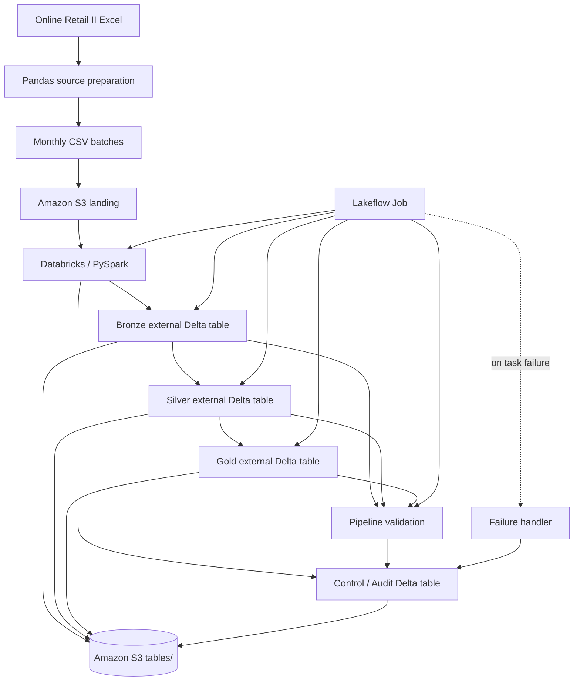

### AWS storage layout

```text
s3://online-retail-databricks/
│
├── landing/
│   ├── 2009-12/
│   │   └── online_retail_2009-12.csv
│   ├── 2010-01/
│   │   └── online_retail_2010-01.csv
│   ├── 2010-02/
│   │   └── online_retail_2010-02.csv
│   └── 2010-03/
│       └── online_retail_2010-03.csv
│
└── tables/
    ├── control/
    │   └── pipeline_runs/
    ├── bronze/
    │   └── transactions_raw/
    ├── silver/
    │   └── transactions_clean/
    └── gold/
        └── product_sales_summary/
```

The Bronze, Silver, Gold, and control tables are **Unity Catalog external Delta tables**. Their Delta transaction logs and Parquet data files are physically stored in the S3 `tables/` area.

## Technology stack

| Technology | Usage |
|---|---|
| Python and Pandas | Read the Excel workbook, preserve source lineage, generate monthly batches, and reconcile exported rows |
| Amazon S3 | Raw landing layer and persistent storage for the Delta tables |
| AWS IAM | Role-based access from Databricks to the S3 bucket |
| Databricks | Lakehouse development and distributed execution environment |
| PySpark | Distributed ingestion, transformation, aggregation, validation, and reconciliation |
| Delta Lake | ACID table format, transaction log, and idempotent `MERGE` operations |
| Unity Catalog | Catalog/schema/table governance and S3 external-location integration |
| Lakeflow Jobs | Parameterized orchestration, task dependencies, retries, and failure routing |
| Databricks SQL | Environment setup and operational monitoring queries |
| GitHub | Project repository, documentation, and execution evidence |

## AWS and Unity Catalog configuration

The AWS integration uses the following components:

- An S3 bucket named `online-retail-databricks`.
- A dedicated IAM role and S3 policy scoped to the `landing/*` and `tables/*` prefixes.
- A Unity Catalog storage credential backed by the IAM role.
- Two Unity Catalog external locations:
  - `s3://online-retail-databricks/landing/`
  - `s3://online-retail-databricks/tables/`
- A separate Unity Catalog catalog named `online_retail_aws` with `bronze`, `silver`, `gold`, and `control` schemas.

### Table locations

```text
online_retail_aws.control.pipeline_runs
→ s3://online-retail-databricks/tables/control/pipeline_runs/

online_retail_aws.bronze.transactions_raw
→ s3://online-retail-databricks/tables/bronze/transactions_raw/

online_retail_aws.silver.transactions_clean
→ s3://online-retail-databricks/tables/silver/transactions_clean/

online_retail_aws.gold.product_sales_summary
→ s3://online-retail-databricks/tables/gold/product_sales_summary/
```

## Data flow and implementation

### Source preparation

The Pandas preparation notebook:

- Reads both workbook worksheets.
- Adds `source_sheet` and the original Excel `source_row_number` before combining the data.
- Derives `batch_id` from `InvoiceDate` in `YYYY-MM` format.
- Exports monthly CSV batches.
- Reconciles the exported files with all **1,067,371 source rows**.

The source-preparation notebook generates monthly CSV batches in `data/monthly_batches/`. The selected batch files are manually uploaded to the corresponding S3 landing prefixes, where the Databricks processing notebooks read them.

### Bronze layer

**Source**

```text
s3://online-retail-databricks/landing/{batch_id}/online_retail_{batch_id}.csv
```

**Target**

```text
online_retail_aws.bronze.transactions_raw
```

**Physical Delta location**

```text
s3://online-retail-databricks/tables/bronze/transactions_raw/
```

The Bronze process:

- Validates the `batch_id` parameter in exact `YYYY-MM` format.
- Reads one monthly CSV from S3 using an explicit PySpark schema.
- Renames source columns to consistent `snake_case` names.
- Preserves workbook lineage and adds Databricks file metadata.
- Adds an ingestion timestamp.
- Generates a stable SHA-256 `record_id` from `source_sheet` and `source_row_number`.
- Validates row counts, key uniqueness, null keys, and batch assignment.
- Uses an insert-only Delta `MERGE` so reruns do not duplicate records or overwrite the initially ingested Bronze version.

### Silver layer

**Source**

```text
online_retail_aws.bronze.transactions_raw
```

**Target**

```text
online_retail_aws.silver.transactions_clean
```

**Physical Delta location**

```text
s3://online-retail-databricks/tables/silver/transactions_clean/
```

The Silver process:

- Profiles missing values, negative quantities, zero prices, and cancelled invoices.
- Removes duplicate business records using a deterministic `row_number()` window.
- Trims relevant text fields.
- Removes the trailing `.0` introduced in populated customer identifiers.
- Retains missing customer IDs, missing descriptions, and negative quantities for downstream analysis rather than deleting potentially genuine records.
- Adds `is_cancelled`, `has_customer_id`, `has_description`, and `is_positive_sale` flags.
- Calculates `line_total` as `quantity * price`.
- Upserts records with Delta `MERGE` using `record_id`.
- Validates stored counts, duplicate keys, missing prepared records, and obsolete records.

A positive sale is a non-cancelled record whose quantity and price are both greater than zero.

### Gold layer

**Source**

```text
online_retail_aws.silver.transactions_clean
```

**Target**

```text
online_retail_aws.gold.product_sales_summary
```

**Physical Delta location**

```text
s3://online-retail-databricks/tables/gold/product_sales_summary/
```

The Gold table has a monthly product grain of `batch_id + stock_code`. It contains:

- Representative product description
- Total quantity sold
- Total revenue
- Distinct invoice count
- Distinct customer count

The Gold process filters to positive sales, validates the composite `MERGE` key, reconciles Silver and Gold measures, and synchronizes only the selected batch. Batch-scoped deletion removes obsolete product summaries for the selected batch without affecting other months.

## End-to-end batch tests

The AWS Lakeflow Job was run end-to-end for the following batches:

<table>
  <thead>
    <tr>
      <th width="110">Batch</th>
      <th>Result</th>
      <th>Purpose / observation</th>
    </tr>
  </thead>
  <tbody>
    <tr>
      <td><code>2009-12</code></td>
      <td>Success</td>
      <td>Full AWS pipeline execution</td>
    </tr>
    <tr>
      <td><code>2010-01</code></td>
      <td>Success</td>
      <td>Full AWS pipeline execution and incremental processing</td>
    </tr>
    <tr>
      <td><code>2010-02</code></td>
      <td>Success</td>
      <td>Full AWS pipeline execution and rerun/idempotency testing</td>
    </tr>
    <tr>
      <td><code>2010-03</code></td>
      <td>Failed → successful rerun</td>
      <td>First run had no source file; after the <code>2010-03</code> CSV was manually uploaded to the corresponding S3 landing prefix, the same batch was rerun successfully</td>
    </tr>
  </tbody>
</table>

## Validation and reconciliation

The independent validation notebook checks that:

- Bronze, Silver, and Gold are filtered to the selected batch for validation and reconciliation.
- The Bronze row count reconciles with the expected Silver row count after business-record deduplication.
- Every Silver `record_id` has a matching Bronze source record.
- Positive-sale quantity and revenue are reconciled between Silver and Gold.

Final `2010-02` reconciliation:

| Measure | Silver | Gold | Result |
|---|---:|---:|---|
| Total quantity | 381,879 | 381,879 | Passed |
| Total revenue | 551,504.72 | 551,504.72 | Passed |

## Incremental processing and idempotency

Every processing notebook accepts `batch_id` and `run_id` parameters. Stable matching keys and Delta `MERGE` operations allow the same monthly batch to be rerun safely.

For `2010-02`, the AWS-backed Delta tables were explicitly rerun and retained the same stored counts:

| Layer | Stored rows after first run | Stored rows after rerun |
|---|---:|---:|
| Bronze | 29,388 | 29,388 |
| Silver | 29,058 | 29,058 |
| Gold | 2,577 | 2,577 |

The repeated runs produced zero duplicate IDs/keys and no missing or obsolete records in the layer-level validation checks.

## Orchestration and failure handling

The Lakeflow Job executes:

```text
bronze_ingestion
    -> silver_transformation
    -> gold_analytics
    -> pipeline_validation
```

The job-level `batch_id` and dynamic `run_id` parameters are passed to the notebook tasks. Downstream tasks execute only after their dependencies succeed.

A separate `failure_handler` task depends on the processing tasks and is triggered when an upstream task fails. It:

1. Receives the task states and error codes.
2. Normalizes unsuccessful states.
3. Records failed and upstream-failed task results in `online_retail_aws.control.pipeline_runs`.
4. Displays the audit records for the failed run.
5. Deliberately raises an exception afterward so the overall pipeline remains visibly failed.

This behavior was tested with batch `2010-03`: the first run failed because the expected S3 source file was missing. After the `2010-03` CSV was manually uploaded to the corresponding S3 landing prefix, the same batch was rerun successfully through Bronze, Silver, Gold, and validation.

## Auditing and monitoring

Each processing task writes operational metadata to:

```text
online_retail_aws.control.pipeline_runs
```

The control table is itself a Delta table stored in S3 at:

```text
s3://online-retail-databricks/tables/control/pipeline_runs/
```

It stores:

- Run ID and batch ID
- Layer name and execution status
- Start and end timestamps
- Input and output row counts
- Error classification

The standalone `06_pipeline_monitoring.ipynb` notebook contains SQL queries for inspecting audit history, unsuccessful tasks, and per-run summaries. It is **not part of the automated Lakeflow Job**; it is used for operational monitoring.

## Execution evidence

### S3 landing layer

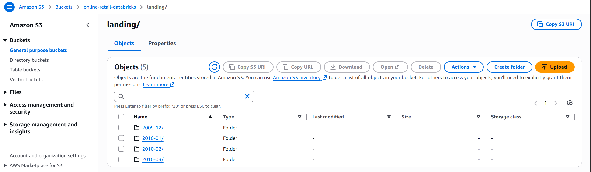

### IAM S3 policy

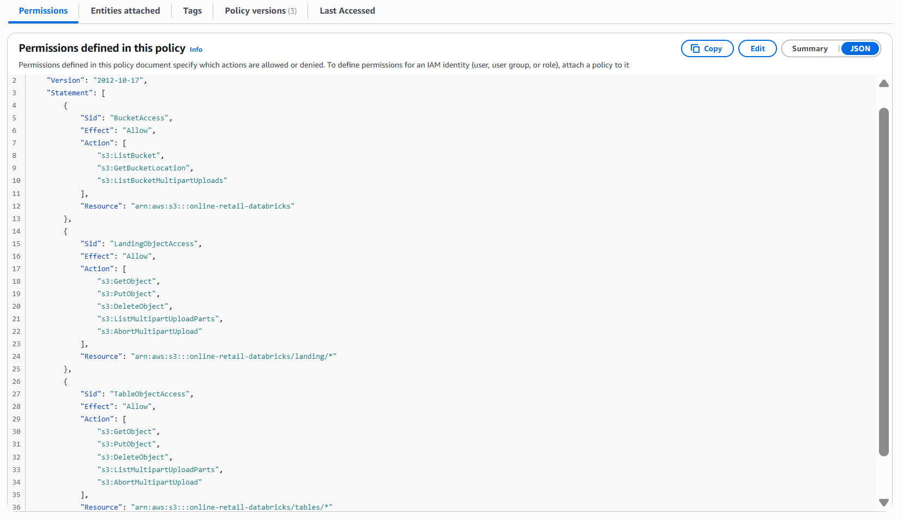

### IAM trust relationship

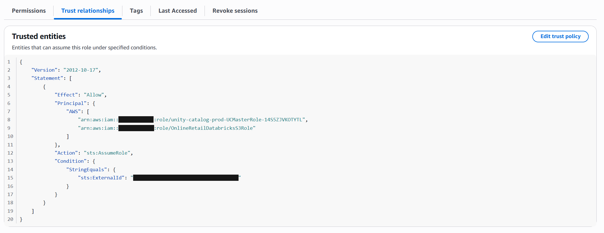

### Databricks storage credential

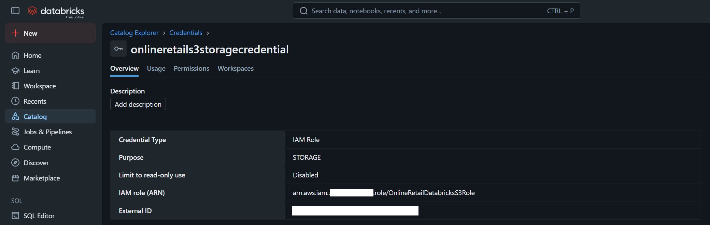

### Unity Catalog external locations

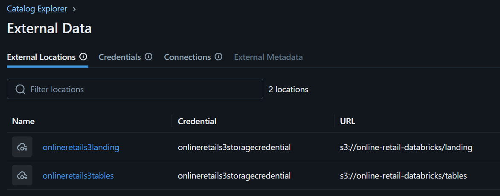

### Bronze Delta table stored in S3

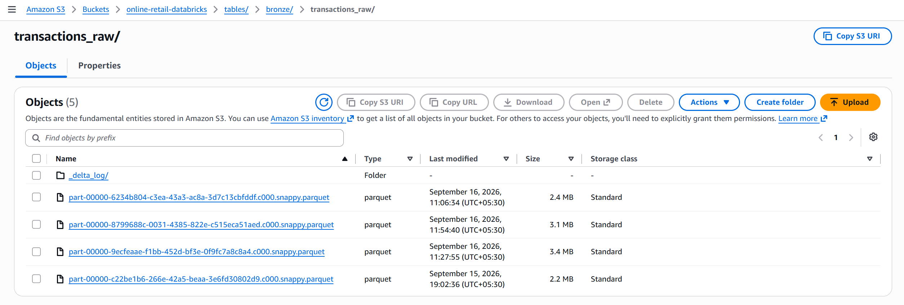

### Silver Delta table stored in S3

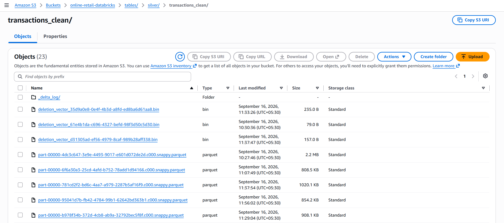

### Gold Delta table stored in S3

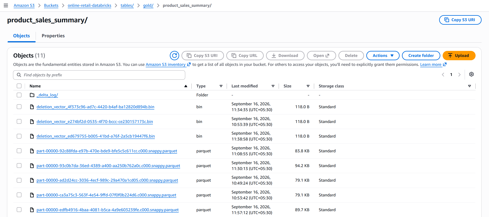

### Successful end-to-end AWS workflow

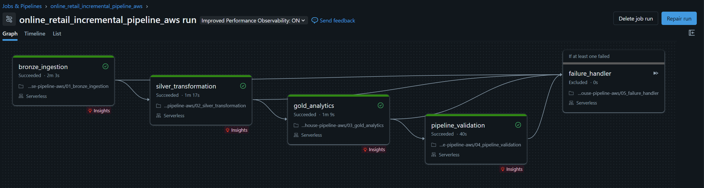

### Controlled failure run

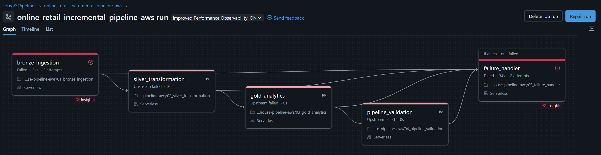

## Repository structure

```text
online-retail-lakehouse-pipeline/
├── data/
│   └── source/
│       └── online_retail_II.xlsx
├── docs/
│   └── images/
│       ├── 01_s3_landing.png
│       ├── 02_iam_s3_policy.png
│       ├── 03_iam_trust_relationship_redacted.png
│       ├── 04_databricks_storage_credential_redacted.png
│       ├── 05_databricks_external_locations.png
│       ├── 06_s3_bronze_delta.png
│       ├── 07_s3_silver_delta.png
│       ├── 08_s3_gold_delta.png
│       ├── 09_aws_workflow_success_2010_03.png
│       └── 10_aws_workflow_failure_2010_03.png
├── notebooks/
│   ├── 01_prepare_monthly_batches.ipynb
│   └── databricks/
│       ├── 00_environment_setup.ipynb
│       ├── 01_bronze_ingestion.ipynb
│       ├── 02_silver_transformation.ipynb
│       ├── 03_gold_analytics.ipynb
│       ├── 04_pipeline_validation.ipynb
│       ├── 05_failure_handler.ipynb
│       └── 06_pipeline_monitoring.ipynb
└── README.md
```

## Notebook guide

| Notebook | Purpose |
|---|---|
| `01_prepare_monthly_batches.ipynb` | Prepare, export, and reconcile monthly CSV batches with Pandas |
| `00_environment_setup.ipynb` | Create the AWS Unity Catalog catalog, schemas, and control table |
| `01_bronze_ingestion.ipynb` | Parameterized S3-to-Bronze incremental ingestion |
| `02_silver_transformation.ipynb` | Profile, deduplicate, clean, flag, validate, and upsert Silver records |
| `03_gold_analytics.ipynb` | Build and synchronize the monthly product-sales summary |
| `04_pipeline_validation.ipynb` | Perform cross-layer validation and Silver-to-Gold reconciliation |
| `05_failure_handler.ipynb` | Record failed and upstream-failed task states and preserve overall job failure |
| `06_pipeline_monitoring.ipynb` | Inspect audit history and summarize pipeline runs; standalone monitoring only |

## How to run

### 1. Prepare the source data

Place the Online Retail II workbook at:

```text
data/source/online_retail_II.xlsx
```

Run `notebooks/01_prepare_monthly_batches.ipynb` locally to generate the monthly CSV batches.

### 2. Configure AWS and Unity Catalog once

The AWS environment requires:

- The S3 bucket and `landing/` and `tables/` prefixes.
- The IAM role and least-privilege S3 policy.
- A Databricks Unity Catalog storage credential.
- External locations for the landing and table prefixes.
- The `online_retail_aws` catalog and its schemas.

### 3. Upload a monthly batch to S3

Upload the selected source CSV to:

```text
s3://online-retail-databricks/landing/YYYY-MM/online_retail_YYYY-MM.csv
```

### 4. Run the Lakeflow Job

Use the job parameters:

```text
batch_id = YYYY-MM
run_id = {{job.run_id}}
```

The workflow processes the batch through Bronze, Silver, Gold, and validation. The failure handler is triggered automatically when an upstream processing task fails.

### 5. Monitor the run

Use `06_pipeline_monitoring.ipynb` to inspect the S3-backed control table and summarize recent runs.

## Implementation summary

This project delivers a reusable incremental monthly lakehouse pipeline using Amazon S3 as the cloud landing layer and persistent Delta storage. Databricks and PySpark process the data through Bronze, Silver, and Gold external Delta tables registered with Unity Catalog. The project also demonstrates idempotent Delta `MERGE` processing, cross-layer reconciliation, audit logging, controlled failure handling, and successful rerun after a missing source file was manually uploaded to S3.
