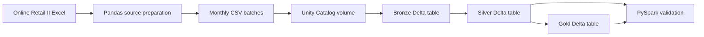

# Online Retail Lakehouse Pipeline

An end-to-end batch data engineering project that transforms retail transaction data through Bronze, Silver, and Gold lakehouse layers using Databricks, PySpark, Delta Lake, Unity Catalog, and Pandas.

## Project overview

The source is the **Online Retail II** Excel workbook containing two worksheets and **1,067,371 records**. Pandas is used locally to preserve source lineage, divide the workbook into monthly CSV batches, and validate batch completeness.

**Dataset:** [Online Retail II – Kaggle](https://www.kaggle.com/datasets/lakshmi25npathi/online-retail-dataset?resource=download)

One monthly batch (`2009-12`) is then processed in Databricks as a working pipeline implementation:

1. **Bronze:** Ingest the CSV using an explicit schema and preserve source metadata.
2. **Silver:** Remove duplicate records, standardize fields, and add data-quality and business-rule flags.
3. **Gold:** Aggregate positive sales by month and product for analytical use.
4. **Validation:** Reconcile Silver and Gold totals using PySpark.

## Architecture



## Technology stack

| Technology | Usage |
|---|---|
| Python and Pandas | Read both Excel sheets, add source metadata, create monthly batches, and validate exported files |
| Databricks | Development and execution environment |
| PySpark | Distributed ingestion, transformation, aggregation, and validation |
| Delta Lake | Reliable managed-table storage for Bronze, Silver, and Gold data |
| Unity Catalog | Catalog, schema, table, and volume organization |
| Databricks SQL | Environment setup and table inspection |
| GitHub | Version control and project documentation |

## Data flow and implementation

### Source preparation

- Reads both workbook sheets with Pandas.
- Records `source_sheet` and the original Excel `source_row_number` before combining the sheets.
- Derives `batch_id` from `InvoiceDate` in `YYYY-MM` format.
- Generates **25 monthly CSV files**.
- Reconciles the generated files against all **1,067,371 source rows**.

### Bronze layer

**Source**

```text
/Volumes/online_retail/bronze/source_files/online_retail_2009-12.csv
```

**Target**

```text
online_retail.bronze.transactions_raw
```

The Bronze process:

- Reads the CSV with its header and an explicit PySpark schema.
- Renames source columns to consistent `snake_case` names.
- Preserves source lineage columns from the preparation stage.
- Adds the source filename, source file path, and ingestion timestamp.
- Writes the result as a managed Delta table.
- Reconciles the source DataFrame and stored table row counts.

**Bronze records stored:** `45,228`

### Silver layer

**Source**

```text
online_retail.bronze.transactions_raw
```

**Target**

```text
online_retail.silver.transactions_clean
```

The Silver process:

- Removes duplicates using the original business columns.
- Trims whitespace from relevant string columns.
- Removes the `.0` suffix introduced in populated customer identifiers.
- Retains records with missing customer IDs or descriptions instead of deleting them.
- Adds the following business and quality flags:
  - `is_cancelled`
  - `has_customer_id`
  - `has_description`
  - `is_positive_sale`
- Calculates `line_total` as `quantity * price`.
- Writes the cleaned result as a managed Delta table.

| Silver quality result | Record count |
|---|---:|
| Bronze input records | 45,228 |
| Duplicate records removed | 506 |
| Silver records stored | 44,722 |
| Cancelled records | 1,013 |
| Positive-sale records | 43,453 |
| Records missing customer ID | 13,446 |
| Records missing description | 228 |

A positive sale is a non-cancelled record whose quantity and price are both greater than zero. Negative quantities are retained because they can represent returns or cancellations.

### Gold layer

**Source**

```text
online_retail.silver.transactions_clean
```

**Target**

```text
online_retail.gold.product_sales_summary
```

The Gold table contains a monthly product-level sales summary. It filters to positive sales, groups records by `batch_id` and `stock_code`, and calculates:

- Product description
- Total quantity sold
- Total revenue
- Distinct invoice count
- Distinct customer count

**Gold summary records stored:** `3,057`

## Pipeline validation

The final notebook independently aggregates positive-sale measures from Silver and compares them with Gold.

| Measure | Silver | Gold | Result |
|---|---:|---:|---|
| Total quantity | 425,461 | 425,461 | Passed |
| Total revenue | 822,483.95 | 822,483.95 | Passed |

The dataset does not provide a confirmed currency in this implementation, so revenue is presented without a currency symbol.

## Repository structure

```text
online-retail-lakehouse-pipeline/
├── notebooks/
│   ├── 01_prepare_monthly_batches.ipynb
│   └── databricks/
│       ├── 00_environment_setup.ipynb
│       ├── 01_bronze_ingestion.ipynb
│       ├── 02_silver_transformation.ipynb
│       ├── 03_gold_analytics.ipynb
│       └── 04_pipeline_validation.ipynb
├── .gitignore
└── README.md
```

| Notebook | Purpose |
|---|---|
| `01_prepare_monthly_batches.ipynb` | Prepare and validate monthly source batches using Pandas |
| `00_environment_setup.ipynb` | Create the Unity Catalog catalog, schemas, and managed volume |
| `01_bronze_ingestion.ipynb` | Ingest one monthly CSV into the Bronze Delta table |
| `02_silver_transformation.ipynb` | Deduplicate, clean, flag, and store Silver records |
| `03_gold_analytics.ipynb` | Produce the monthly product sales summary |
| `04_pipeline_validation.ipynb` | Reconcile Silver and Gold measures using PySpark |

## How to run

1. Download the Online Retail II Excel workbook and place it at:

   ```text
   data/source/online_retail_II.xlsx
   ```

2. Run `notebooks/01_prepare_monthly_batches.ipynb` locally. It creates the monthly CSV files under `data/monthly_batches/`.
3. In Databricks, run `00_environment_setup.ipynb` to create the catalog, schemas, and volume.
4. Upload `online_retail_2009-12.csv` to:

   ```text
   /Volumes/online_retail/bronze/source_files/
   ```

5. Run the Databricks notebooks in this order:

   ```text
   01_bronze_ingestion
   02_silver_transformation
   03_gold_analytics
   04_pipeline_validation
   ```

The original Excel workbook and generated CSV files are intentionally excluded from this repository.

## Limitations and future improvements

This repository demonstrates a completed single-batch lakehouse pipeline. The following capabilities are not claimed as part of the current implementation:

- Automated ingestion of all monthly files
- Incremental processing and watermarking
- Idempotent reruns using Delta `MERGE`
- Control and audit tables
- Record quarantine tables
- Workflow orchestration and scheduling
- Automated data-quality tests and alerting

These would be the next steps for developing the project into a production-style pipeline.
